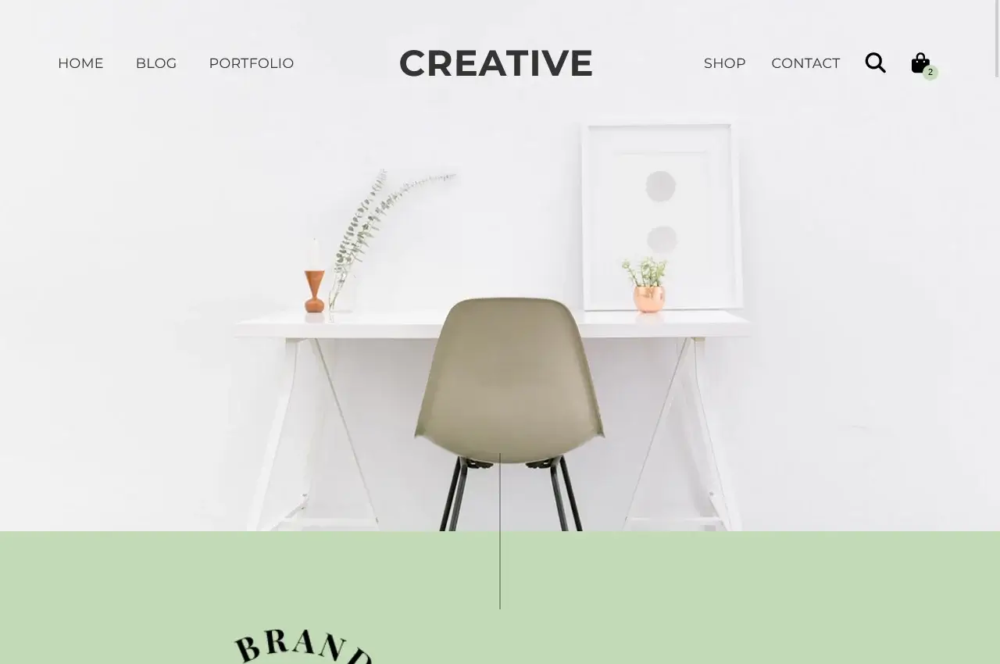

## Table of contents

- [Overview](#overview)
  - [Screenshot](#screenshot)
  - [Links](#links)
- [Built with](#built-with)
- [Author](#author)

## Overview
This multi-page site was made by converting PNG design documents provided by Juno College during the Web Development Bootcamp. I've accurately replicated the provided desktop layouts and then added responive styling and JavaScript functionality. 

The user can navigate to the home, blog, and contact pages. 

Some functionality highlights include:
- mobile nav
- search bar animation
- blog page comment form
- home page gallery

### Screenshot

### Links

- [GitHub Repo](https://github.com/frances-m/creative-design-site)
- [Live Site](https://francesm-creative-design.netlify.app/)

## Built with

- Vanilla JavaScript
- SCSS
- Semantic HTML
- BEM naming convention

## Author

- [Portfolio Site](https://francesm.dev)
- [LinkedIn](https://www.linkedin.com/in/fr-ncesm/)
